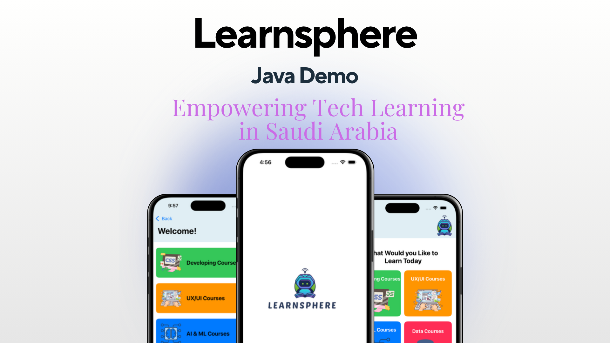

# Learnsphere (Android)
**Empowering Tech Learning in Saudi Arabia**

 
## Overview  
Learnsphere is an educational app designed to provide users in Saudi Arabia with online and in-person courses in tech fields like AI, UX/UI design, and programming.  
A Swift-based version of the app is also available for iOS devices: [LearnSphere_Swift](https://github.com/janaalbader28/LearnSphere_Swift)

## 📽 Demo

## Features  
### User Features  
- **Sign Up**: Create a new account to access learning resources.  
- **Forgot Password**: Recover your account if you forget your credentials.  
- **Home Page**: Explore various learning categories, including Development, UX/UI, AI & ML, and Data.  
- **Challenges**: View challenges with detailed descriptions.  
- **Ask Experts**: Submit queries directly to tech experts.  
- **Settings**: Update profile, log out, or delete account.  

### Admin Features  
- **Course Management**: Admins can add, delete, and update courses.  
- **Settings**: Manage partner contacts and log out options.  

## Technology Used  
- **Android Studio**: Development environment.  
- **Java**: Programming language.  

## Design Inspiration  
This project’s design was inspired by a [YouTube video](https://www.youtube.com/watch?si=MOXlba-_869Jqelh&v=PdOJZakneXc&feature=youtu.be).

## 👩‍💻 Developers

- **Jana Albader**  
  

    
    
  

  
- **Jumana Khawaji**  
  

    
    
  

- **Atheer Al Otaibi**  
  

    
    
  

- **Rama Alzahrani**  
  

    
    
  

- **Ruba Alshehri**  
  

    
    
  

